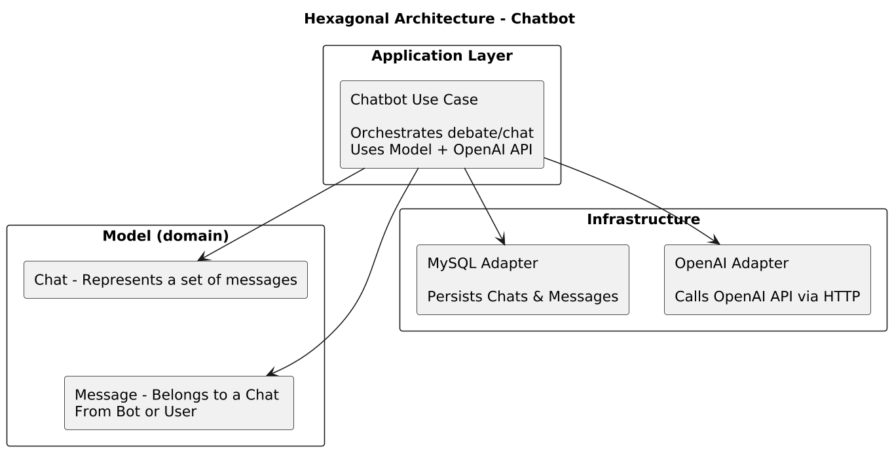
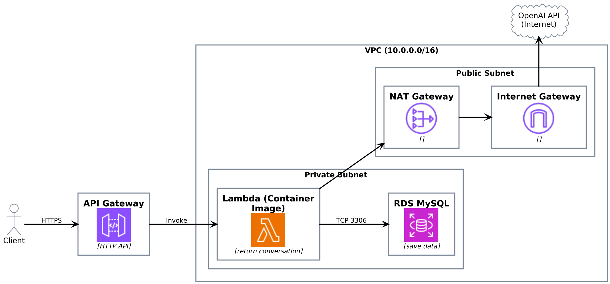

# KOPICHAT
Kopichat is a chatbot API, the main purpose of this chatbot is to talk to you and debate to try to convince you of your point of view.

## Unique endpoint

### REQUEST
You can send a 'conversation_id' if you have one, but if you don't have the id, return your new conversation_id in the response.

```json
{
    "conversation_id": "text" | null,
    "message": "text"
}
```

### RESPONSE
Returns a response with the last 5 messages sent between you.

```json
{
    "conversation_id": "text",
    // history of the 5 most recent messages on both sides. most recent message last
    "message": [
        {
            "role": "user",
            "message": "text"
        },
        {
            "role": "bot",
            "message": "text"
        },
          {
            "role": "user",
            "message": "text"
        },
        {
            "role": "bot",
            "message": "text"
        },
        {
            "role": "user",
            "message": "text"
        }
    ]
``` 
---

## Before
First of all, go to the page and create an api key to use the services of our chatbot and define it in your system as

https://platform.openai.com/docs/overview

```bash
export OPENAI_API_KEY=sk-p
```

## Public URI (Download the postman collection into docs/postman)
***Recomend***: **Download the postman collection into docs/postman**
https://ujbmokldvh.execute-api.us-west-1.amazonaws.com/api/chat


## Makefile instructions

- ***make***: shows a list of all possible make commands

- ***make install***: install all requirements to run the service, in this case require Docker for build, test and local running

- ***make test***: run tests 

- ***make run***: Build the chatbot image (buildx, linux/amd64 and start services with docker compose.
Requires env vars: OPENAI_API_KEY

- ***make down*** : Stop and remove services, networks, and volumes (removes orphans).

- ***make down*** :  Stop and remove services, networks, and volumes (removes orphans).

- ***make clean***: teardown and removal of all containers


## Architecture 
A hexagonal architectural approach was used with the following components:
### Model:
- ***Chat***: It represents a set of messages but has its own identity as it is a set of messages received and sent with the bot.
- ***Messages***: It is a message either from the bot or the user and belongs to some chat
### application
- ***use case**: Chatbot is a use case where a bot and a user have a debate and chat, combining the use of the model and the integration of the OpenAI API.

### Infra

- ***mysql***: Connects with MySQL database
- ***OpenAI***: Makes HTTP requests to the OpenAI API to process messages and conversations.



## CLOUD (AWS) 

The service resides on a simple but powerful AWS architecture that uses the following components:

- ***API Gateway***: Expose HTTP/REST endpoints and route external requests to your services or Lambdas.
- ***Lambda functions***:execute serverless code in response to on-demand events.
- ***RDS MySQL***:Managed MySQL database service on AWS.
- ***VPC***: Virtual private network that isolates and organizes your resources in AWS.

Othe components
- ***Docker***:Platform for packaging and running applications in portable containers. Used to deploy Go code in a Lambda.
- ***ECR***: AWS registry for storing and distributing Docker container images
- ***Open AI API*** : External service that processes natural language and artificial intelligence via HTTP.



Things to improve in this MVP in the future:
- Increased testing
- Added documentation to various parts of the code